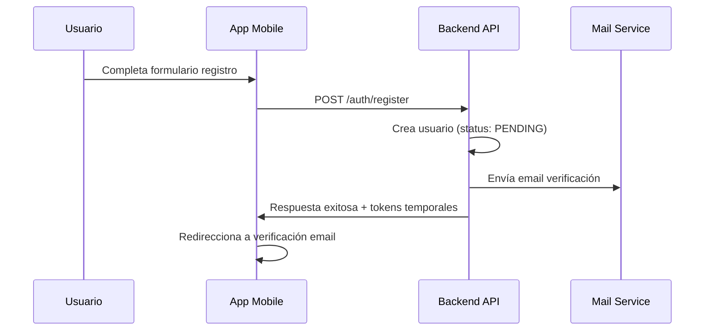
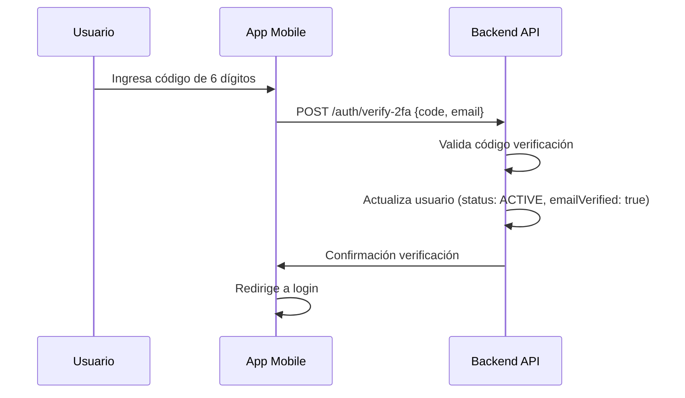
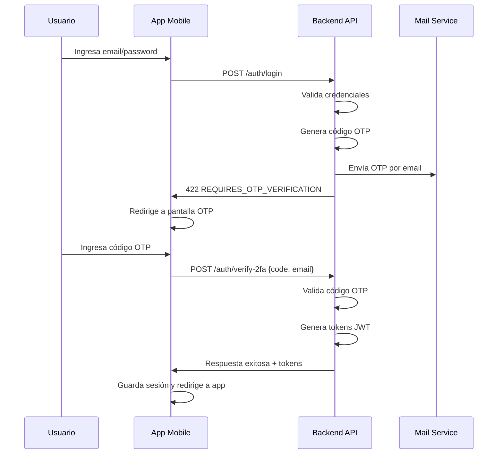
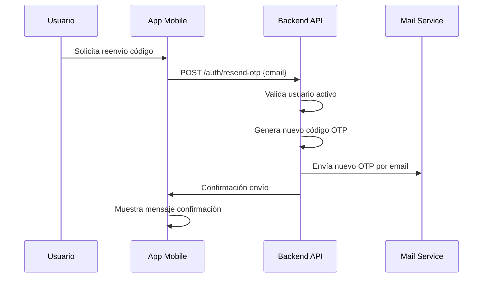

# Flujo de Autenticación con OTP - RutaFácil

## Descripción General

El sistema de autenticación de RutaFácil implementa un flujo de **Autenticación de Dos Factores (2FA)** obligatorio usando códigos OTP (One-Time Password) enviados por correo electrónico. Esto garantiza mayor seguridad en el acceso a la aplicación.

## Flujo Completo de Autenticación

### 1. Registro de Usuario



### 2. Verificación de Email (Primera vez)



### 3. Login con OTP



### 4. Reenvío de Código OTP



## Endpoints del API

### Autenticación Principal

| Endpoint | Método | Descripción |
|----------|--------|-------------|
| `/auth/login` | POST | Inicia proceso de login, envía OTP |
| `/auth/verify-2fa` | POST | Verifica código OTP/Email |
| `/auth/resend-otp` | POST | Reenvía código OTP para login |
| `/auth/register` | POST | Registra nuevo usuario |
| `/auth/resend-verification` | POST | Reenvía verificación de email |

### Request/Response Examples

#### Login
```json
// Request
POST /auth/login
{
  "email": "usuario@ejemplo.com",
  "password": "miPassword123"
}

// Response (Requiere OTP)
422 Unprocessable Entity
{
  "success": false,
  "message": "Debes completar la verificación OTP para acceder",
  "requiresOTPVerification": true,
  "email": "usuario@ejemplo.com"
}
```

#### Verificación OTP
```json
// Request
POST /auth/verify-2fa
{
  "code": "123456",
  "email": "usuario@ejemplo.com"
}

// Response (Login Exitoso)
200 OK
{
  "success": true,
  "data": {
    "user": {
      "id": 1,
      "name": "Juan",
      "email": "usuario@ejemplo.com",
      "role": "USER",
      "emailVerified": true
    },
    "expiresIn": "7d",
    "message": "Login completado exitosamente"
  }
}
```

#### Reenvío OTP
```json
// Request
POST /auth/resend-otp
{
  "email": "usuario@ejemplo.com"
}

// Response
200 OK
{
  "success": true,
  "data": {
    "message": "Código OTP reenviado exitosamente"
  }
}
```

## Implementación Frontend (React Native)

### Componentes Principales

1. **LoginScreen** (`app/login.tsx`)
   - Manejo de credenciales
   - Detección de respuesta OTP
   - Redirección a verificación

2. **OtpVerificationScreen** (`app/otp-verification.tsx`)
   - Entrada de código 6 dígitos
   - Validación automática
   - Reenvío de código
   - Manejo de sesión exitosa

3. **AuthService** (`utils/auth.service.ts`)
   - Métodos de comunicación con API
   - Manejo de tokens y sesiones
   - Persistencia con AsyncStorage

### Contexto de Autenticación

El `AuthContext` (`utils/auth.context.tsx`) maneja:
- Estado global de autenticación
- Persistencia de sesión
- Métodos de login/logout
- Información del usuario actual

## Configuración de Correo

### Variables de Entorno Requeridas

```env
# Configuración SMTP
MAIL_HOST=smtp.gmail.com
MAIL_PORT=587
MAIL_SECURE=false
MAIL_USER=tu-email@gmail.com
MAIL_PASS=tu-app-password

# URLs de Frontend
FRONTEND_URL=http://localhost:8081
```

### Plantillas de Email

El sistema utiliza plantillas HTML personalizadas para:
- Códigos OTP de login
- Verificación de email inicial
- Recuperación de contraseña
- Notificaciones de rutas

## Seguridad Implementada

### Códigos OTP
- **Duración**: 10 minutos
- **Formato**: 6 dígitos numéricos
- **Almacenamiento**: Temporal en memoria (producción: Redis)
- **Códigos de desarrollo**: `123456`, `000000`, `111111`

### Validaciones
- ✅ Email válido y existente
- ✅ Usuario activo (status: ACTIVE)
- ✅ Email verificado
- ✅ Contraseña correcta antes de enviar OTP
- ✅ Código no expirado
- ✅ Un solo uso por código

### Tokens JWT
- **Duración**: 7 días
- **Algoritmo**: HS256
- **Payload**: id, email, role, name
- **Storage**: AsyncStorage (móvil) + Cookies HTTP-only (web)

## Manejo de Errores

### Códigos de Error Comunes

| Código | Descripción | Acción Frontend |
|--------|-------------|-----------------|
| 401 | Credenciales inválidas | Mostrar error en login |
| 422 | Requiere OTP | Redirigir a verificación OTP |
| 400 | Código OTP inválido | Limpiar campos y enfocar |
| 403 | Usuario inactivo | Contactar administrador |
| 404 | Usuario no encontrado | Verificar email |
| 500 | Error servidor | Reintentar operación |

## Logs y Monitoreo

### Logs de Seguridad
```
🔑 Código OTP generado para user@example.com: 123456 (expira: 2024-01-15 14:30:00)
✅ Código OTP válido para user@example.com
❌ Código OTP inválido para user@example.com. Esperado: 123456, Recibido: 654321
⏰ Código OTP expirado para user@example.com
```

### Métricas Importantes
- Intentos de login fallidos
- Códigos OTP expirados
- Tiempo promedio de verificación
- Solicitudes de reenvío

## Consideraciones de Producción

### Recomendaciones
1. **Usar Redis** para almacenamiento de códigos OTP
2. **Rate limiting** en endpoints de reenvío
3. **Logs de auditoría** completos
4. **Monitoreo** de intentos fallidos
5. **Backup** de configuración SMTP

### Escalabilidad
- Los códigos OTP están aislados por email
- Sin dependencias de sesiones
- Compatible con múltiples instancias
- Cache distribuido con Redis

## Testing

### Códigos de Desarrollo
Para facilitar el testing, estos códigos siempre funcionan:
- `123456`
- `000000`
- `111111`

### Casos de Prueba
1. ✅ Login completo exitoso
2. ✅ Código OTP incorrecto
3. ✅ Código OTP expirado
4. ✅ Reenvío múltiple de códigos
5. ✅ Usuario no verificado
6. ✅ Usuario inactivo
7. ✅ Credenciales incorrectas

---

**Nota**: Este flujo está diseñado para máxima seguridad y debe mantenerse actualizado con las mejores prácticas de autenticación.
